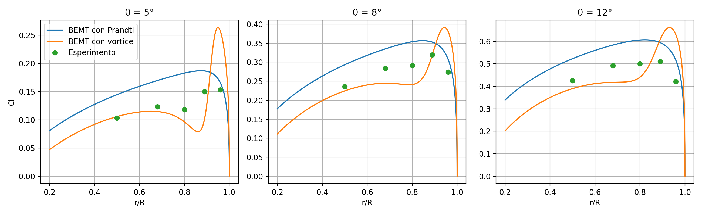
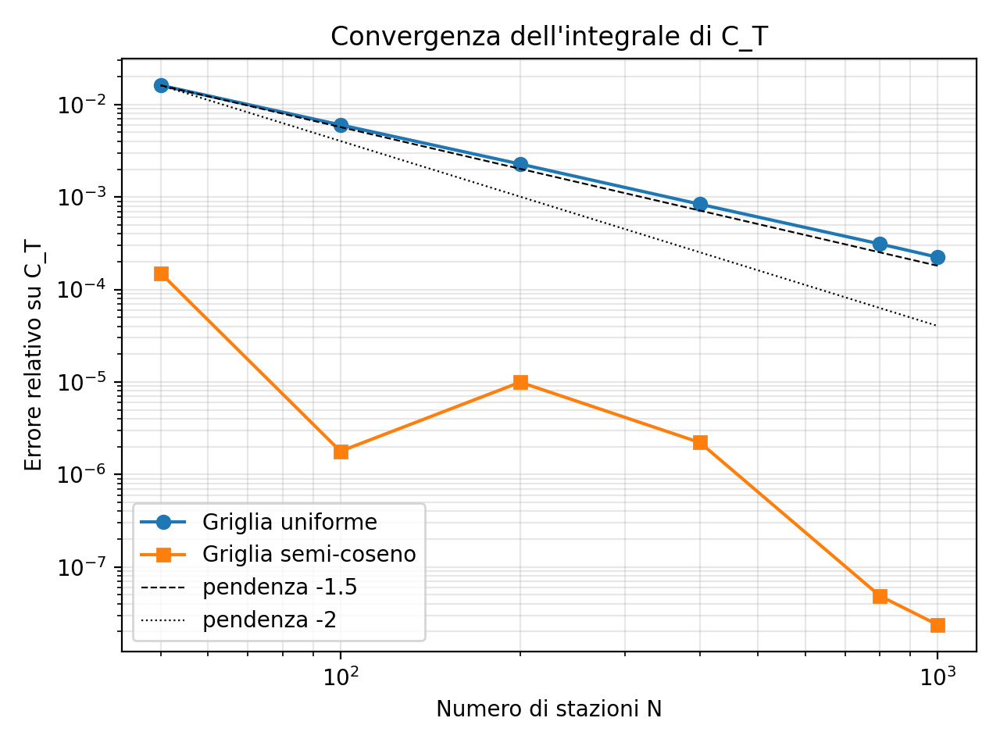
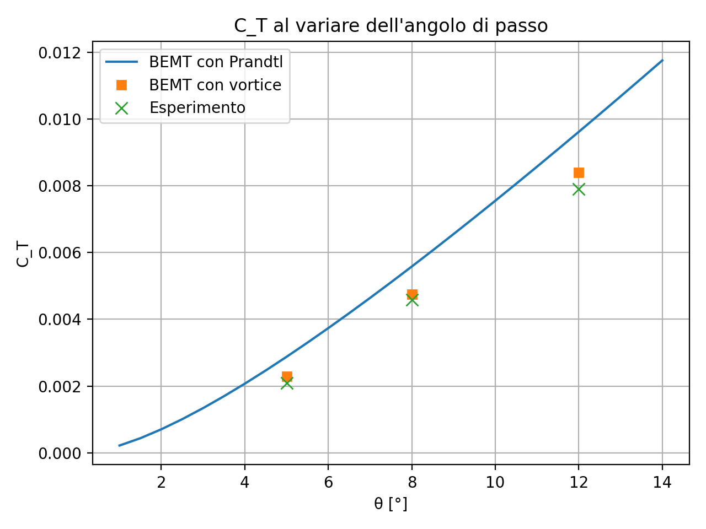

# BEMT with Tip-Vortex Correction for a Hovering Rotor
### Validation against the Caradonna & Tung benchmark (NASA TM-81232)

A Blade Element Momentum Theory (BEMT) model for a rotor in hover, written from scratch in Python and validated against the experimental data of Caradonna & Tung (1981). The model is then extended with a correction for the tip vortex of the preceding blade, based on the measured wake geometry.

The aim is not only to match the experiment, but to understand **where and why** a low-order model deviates from it.

**Main result.** Classical BEMT with Prandtl tip loss overpredicts the thrust by 22–37%. Adding the tip vortex of the preceding blade, with the measured wake geometry and **no parameter tuning**, reduces the thrust error to 4–9% at three collective pitch angles. The spanwise loading improves on the inboard part of the blade but is strongly overpredicted near the tip, so part of the thrust agreement comes from compensating errors.



---

## Test case

| Parameter | Value |
|---|---|
| Rotor radius R | 1.143 m |
| Chord c | 0.1905 m |
| Number of blades | 2 |
| Airfoil | NACA 0012, untwisted, untapered |
| Solidity σ | 0.106 |
| Rotational speed | 1250 rpm (tip Mach number 0.44) |
| Collective pitch | 5°, 8°, 12° |

---

## Method

Notation: x = r/R, inflow ratio λ = v/(ΩR), collective pitch θ.

**1. Uniform inflow.** Blade element theory, C_T = (σa/2)(θ/3 − λ/2), combined with momentum theory, C_T = 2λ².

**2. BEMT.** The two balances are applied to each annulus of width dx:

- momentum: dC_T = 4Fλ²x dx
- blade element: dC_T = (σa/2)(θx² − λx) dx

which gives, at each radial station, Fλ² + (σa/8)λ − (σa/8)θx = 0.

**3. Prandtl tip loss.** F = (2/π) arccos(e^(−f)), with f = (N/2)(1 − x)/λ. Since F depends on λ, the system is solved by fixed-point iteration (tolerance 1e-8 on max|Δλ|, convergence in about 10 iterations). The root is computed as λ = −2C/(B + √(B² − 4AC)), which is algebraically equivalent to the standard formula but remains defined at the tip, where F = 0.

**4. Tip-vortex correction.** The tip vortex shed by the preceding blade (vortex age 180°) passes below the blade. It runs in the azimuthal direction, so in the radial–vertical plane of the blade it appears as a point vortex at (r_v, z_v), taken from the measured wake geometry (Figs. 9–10 of the report). Its vertical induced velocity (Biot–Savart, 2D) is added on the blade-element side only:

- λ_v = −Γ_max (x − r_v) / (2π d² ΩR²), with d² = (x − r_v)² + z_v²
- Fλ² + (σa/8)λ − (σa/8)(θx − λ_v) = 0
- Cl = a(θ − (λ + λ_v)/x)

The vortex strength is the maximum bound circulation of the blade, Γ = ½ ΩxR c Cl (Kutta–Joukowski), consistent with the hot-wire measurements of the same authors. Since Γ_max depends on the solution, it is updated within the same fixed-point loop.

**Numerics.** Near the tip the loading behaves as √(1 − x), so with uniform spacing the trapezoidal rule converges with order ~1.5 instead of 2. A half-cosine grid clusters the stations towards the tip and reaches a relative error below 2·10⁻⁴ on C_T with only 50 stations. All results use a half-cosine grid with 200 stations.



### Assumptions

- Steady hover, fully developed wake
- Linear lift curve, a = 5.7 /rad (effective value, see the compressibility test); small angles (φ ≈ λ/x)
- Blade root at 0.2R; profile drag neglected in the thrust
- Vortex modelled as a straight 2D line vortex: its curvature (ring of radius ~0.9R, at a distance of ~0.1R from the blade), its finite length, the older turns of the helix and the inner vortex sheet are neglected

---

## Results

### Baseline: BEMT with Prandtl tip loss

The model overpredicts the thrust at all pitch angles, and the sectional lift at all stations (at 8°: +24%, +18%, +22%, +11%, +12% at r/R = 0.50, 0.68, 0.80, 0.89, 0.96). Reading the model C_T–θ curve at the measured thrust values, the model matches the experiment at an angle about 1–1.5° lower: the missing physics behaves like a nearly constant excess of angle of attack, i.e. a missing downwash.

### Tip-vortex correction: predictive validation

Vortex positions read from the report and never adjusted; vortex strength equal to the maximum bound circulation at all angles.

| θ | C_T error, Prandtl | C_T error, with vortex | Mean \|Cl error\|, Prandtl | Mean \|Cl error\|, with vortex | Same, without r/R = 0.96 |
|---|---|---|---|---|---|
| 5° | +37.0% | +9.4% | 33% | 26% | 39% → 15% |
| 8° | +21.6% | +3.6% | 17% | 15% | 19% → 9% |
| 12° | +21.7% | +6.2% | 20% | 21% | 20% → 14% |



- **The thrust improves at all three angles**, by a factor of 3–6, without any tuning.
- **On the inboard part of the blade the error is reduced on average**, but not uniformly: at 8° it drops from +24% to −5% at r/R = 0.50, but only from +18% to −14% and from +22% to −17% at 0.68 and 0.80. The systematic overprediction turns into a moderate underprediction.
- **Near the tip the loading is strongly overpredicted** (+39% to +68% at r/R = 0.96). Over all five stations the mean error is roughly unchanged, so the very good thrust agreement is **partly due to compensating errors** between the inboard and tip regions.

### Sensitivity studies

| Test | Effect | Conclusion |
|---|---|---|
| Vortex position ±0.025R (8°) | Cl error at 0.80R ranges from −42% to −5% | The loading is very sensitive to the vortex position, as concluded in the original report. The best combination is a calibration, not a validation. |
| Without Prandtl tip loss (8°) | Tip error +90% | The tip loading must vanish: Prandtl is still needed. This does not prove that the two effects are independent, since F also models the helical wake of all blades. |
| Mean vortex downwash removed (8°) | C_T error +19%, inboard now overpredicted | The experiment lies between this case and the full vortex: partial double counting between the actuator-disk inflow and the discrete vortex. |
| Weaker vortex, k = 0.81 (5°) | C_T error from +9% to +16% | The residual error at 5° is not explained by the vortex strength. |
| Compressibility, Prandtl–Glauert (8°) | C_T error from +3.6% to +6.3%, tip worse | The incompressible assumption is not the cause of the overprediction. |
| Viscous core, r_c = 0.01–0.02 (5°) | Mean Cl error from 26% to 21%, C_T slightly worse | Secondary effect; it does not explain the tip error. |

---

## Discussion and limitations

**The tip overprediction is systematic** at all angles and survives every sensitivity test. The most likely causes are:

1. the straight 2D vortex overestimates the upwash outboard of the vortex compared with the real curved, finite filament;
2. Prandtl's factor places the wake edge at x = 1, while the contracted wake has its edge at ~0.9R;
3. three-dimensional tip effects on a blade of aspect ratio 6;
4. uncertainty in the experimental data near the tip: at 12°, even the lifting-surface code of the original authors overpredicts the loading at r/R = 0.96.

**The hybrid model double counts part of the wake.** The actuator-disk inflow already represents the average effect of the whole wake, including the tip vortices, and the discrete vortex is added on top of it. The model cannot determine how much of the vortex is already contained in the momentum inflow: adding it in full counts too much, removing its mean counts too little.

**Experimental data** were read by eye from the figures of the report (uncertainty about ±0.005 on Cl), and the vortex positions from the wake-geometry plots.

### Next step

The consistent way to remove the double counting is to drop momentum theory and describe the whole wake with vortex filaments: a **prescribed-wake model**, with helical tip vortices following empirical wake laws (Landgrebe, Kocurek & Tangler) and Biot–Savart induction on a lifting line.

---

## Repository structure

| File | Content |
|---|---|
| `modello.py` | Rotor parameters and model functions (uniform inflow, BEMT, Prandtl, tip-vortex correction) |
| `dati_sperimentali.py` | Experimental data from NASA TM-81232, with the figure each value comes from |
| `main.py` | All analyses in sequence; figures are saved in `figure/` |

Code comments are in Italian.

### How to run

Requirements: Python 3, NumPy ≥ 2.0, Matplotlib.

```
pip install -r requirements.txt
python main.py
```

---

## References

1. F. X. Caradonna, C. Tung, *Experimental and Analytical Studies of a Model Helicopter Rotor in Hover*, NASA TM-81232, 1981.
2. C. Tung, S. L. Pucci, F. X. Caradonna, H. A. Morse, *The Structure of Trailing Vortices Generated by Model Rotor Blades*, NASA TM-81316, 1981.
3. J. G. Leishman, *Principles of Helicopter Aerodynamics*, Cambridge University Press, chapter 3.
4. L. N. Sankar, AE 6070 Rotorcraft Aerodynamics lecture notes, Georgia Institute of Technology.
